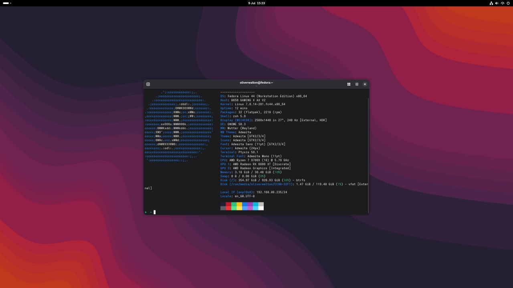

## Ubuntu 16.04

I had quite an unconvential start to discovering Linux, I was trying to learn how to build custom ROMs on Android back when I had a OnePlus 3 with "Stock" Android. Looking at the documentation what does it recommend? Ubuntu! Can install the toolchain, have the terminal and won't uncover weird edgecases as it is what Google are using. 

But what did I learn? Building AOSP is a headache after a headache - fix a single line, wait an hour just to be hit with another build error - and even when it does build, you flash the final build just for missing wifi HALs. Great... However, I quickly caught on to installing all apps, tools, libraries, updates from one location system-wide. There were other benefits too: performance, UI consistency, no telemetry, no ads etc.

What started to wear on me though was Canonical's own choices made to the distro, rather than anything wrong with Linux itself. Unity was the first DE I had used - a desktop I liked, but was decreasingly supported and was struggling to keep up with the innovations seen in GNOME and KDE. Then there was the Amazon deal: for a while, typing to search my own system also fired those queries off to Amazon and surfaced shopping results right alongside my local files. A search on my own system quietly becoming an ad channel was exactly the kind of "telemetry and ads" I'd stayed on Linux to get away from. Snap was also introduced at a similar timeframe - slow first launches, an auto-updating store I couldn't fully opt out of, all funnelled through Canonical's own backend rather than something the wider community controlled (despite flatpak being available on most distros). None of these were dealbreakers on their own, but together they made Ubuntu feel like it was steadily losing the Linux spirit.

## Solus

By early 2019 I was getting more into the ways of Linux and noticing the shortfauls of Ubuntu at the time. I came across Solus, which wasn't built on top of another distro the same way Ubuntu is on top of Debian. I quickly noticed how much more performant it was, no extra services I don't use being installed, newer kernel etc. A lot of this performance also came from the Budgie desktop - Solus's flagship desktop. Design was clean, fast-feeling and deliberate in a way that made it feel bloatless and responsive. 

The install was painless and Budgie delivered exactly what it promised - snappy, good-looking out of the box, no fighting it to feel comfortable. What I did start running into was the size of the official repos. `eopkg` covered the mainstream stuff fine, but the moment I wanted something less mainstream the seamlessness definitely fell apart, it was definitely a smaller distro in comparison to the Ubuntu I just came from. Often building from source, which wasn't a great place to be as someone who still didn't fully trust the terminal yet. Solus didn't do anything wrong - I just ran out of what its repos could give me - both in the AOSP toolchain libraries and bigger apps like Google Chrome.

## Fedora (Round One)

Fedora came next, mostly on the back of people in the community pointing me towards it, and because it genuinely looked good - clean, vanilla GNOME as its flagship rather than something heavily reskinned. It also had a reputation as the place a lot of actual Linux development happened, upstream of RHEL and usually first to ship whatever the rest of the ecosystem would catch up to a year later.

My first impressions were strong. Plymouth made booting feel polished in a way I hadn't really noticed mattering before, GNOME stock was a different, more coherent experience than Ubuntu's modified version, and current packages without rolling-release volatility felt like a good middle ground. I had no real intention of moving on from it.

## Arch

Then I had a free day, and Arch had been on the list for a while - I'd been put off by the manual install, but with nothing else to do that excuse ran out. ISO flashed to a USB, booted in UEFI, dropped straight into a TTY prompt with nothing else. A few hours and a [tutorial by Ufoludek](https://www.youtube.com/watch?v=-zb8220uUiA) later, I had a minimal, fully manual Arch install up and running.

This wasn't about the meme. I wanted a system with nothing on it I hadn't deliberately put there - no bundled desktop environment to strip back out, no default services I hadn't asked for. Going through partitioning, `pacstrap`, fstab and the bootloader by hand meant every piece of the system was a decision I'd actually made, rather than one an installer made for me. I went with `systemd-boot` over GRUB for the bootloader, mainly for the boot speed.

Once I was at a TTY with a working base, I installed GNOME and GDM on top. Left completely stock the GNOME workflow isn't really my taste, but `dash-to-dock` fixed enough of that for me to never seriously consider switching desktop environments over it. I also kept the [Coverflow Alt-Tab](https://extensions.gnome.org/extension/97/coverflow-alt-tab/) extension running purely because it looks good cycling through open windows.

The AUR was the other big pull. As someone who still wasn't keen on compiling basic applications from source, having the AUR rather including build scripts to automate the process, rather than needing a manual build was a nice luxury. `pacman` was fast, the AUR had everything Solus's repos didn't, and the resulting system was exactly as lean as I'd set out to make it. Rolling release kept it current too (besides GNOME packages having a few days of testing before being released onto the main repos), which was great. It was shockingly stable for a couple years too, until an upgrade needed a manual intervention step from the Arch news feed that I hadn't read before running `pacman -Syu`. Nothing catastrophic though the sympton was a resulting unbootable distro, just a reminder that "fully custom" and realistically insufficient package testing comes at a price.

### SteamOS on the Steam Deck

The one place I still run something Arch-based day to day is my Steam Deck. SteamOS 3 is built on Arch under the hood, so `pacman`, the same package base and that familiar rolling foundation are all sitting underneath - but Valve ships it as an atomic, immutable system rather than the fully mutable install I put together by hand. The root filesystem is read-only and updates arrive as a whole new image that gets swapped in, so there's no half-applied `pacman -Syu` leaving you unbootable, and if an update misbehaves you just boot the previous image. It's the same Arch lineage I liked.

## Fedora (Round Two)

I came back to Fedora eventually for one specific reason: I was tired of an update quietly breaking a config file I'd carefully set up, and not noticing until something stopped working days later. On a rolling release that risk never really goes away - any `pacman -Syyu` can rewrite a default or shift a path, and it's on you to catch it before it breaks functionality of your current setup. Fedora's six-month cycle gives me the same current packages and GNOME-first experience I liked the first time around, but with the consistency of testing and stable baseline offered by the 6 month release cycles.

Arch didn't do anything wrong. It's that "fully custom" became annoyig re-verifying my own config after every update, and Fedora gets me most of what Arch taught me to want - current, well-packaged, predictable - without that tax. The `rpm-ostree`-based variants like Silverblue or Kinoite are still sitting there if I ever want atomic, rollback-able updates to take that risk to zero. Fedora also offers a modern setup with all of the features and security requirements I was doing manually on Arch anyway: secure boot, SELinux, systemd-boot, plymouth etc.

## My Hopping Journey

- **Ubuntu** got me in the door for a completely unrelated reason - building Android ROMs - and turned out to be the easiest possible place to learn the basics.
- **Solus** taught me that a lighter desktop and a smaller repo are a real tradeoff, not a free lunch.
- **Fedora (first time)** put me close to where Linux was actually moving, with a clean GNOME experience to match.
- **Arch** taught me what a distro is actually made of, by making me assemble one with nothing pre-decided.
- **Fedora (second time)** is where all of that landed - chosen specifically to avoid the one thing rolling release kept costing me: updates breaking configs I'd already gotten right.

## Conclusion

Looking back, none of the moves were really about chasing the next shiny thing - each distro was a direct answer to whatever the last one had just finished annoying me about. Ubuntu got the door open, Solus taught me that debloated has a cost, Fedora showed me what "current" without volatility looks like, and Arch made me actually understand what all those pieces were doing instead of just trusting an installer. By the time I landed back on Fedora, I wasn't picking it because it was novel, I was picking it because I'd already found out what I didn't want.

I don't think Fedora is the "correct" answer for everyone, it's just the one that stopped costing me time for the way I use a machine day to day. If you're earlier in the hopping cycle yourself, I'd say don't skip the annoying distros - Arch specifically taught me more about how Linux actually works than any of the polished ones did, even though it's not where I stayed.
