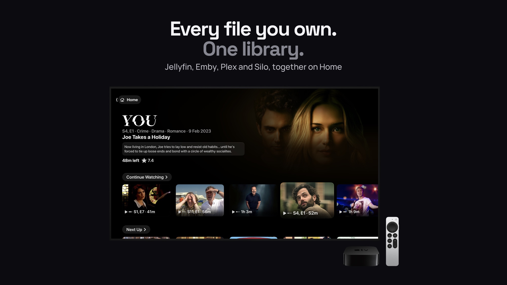
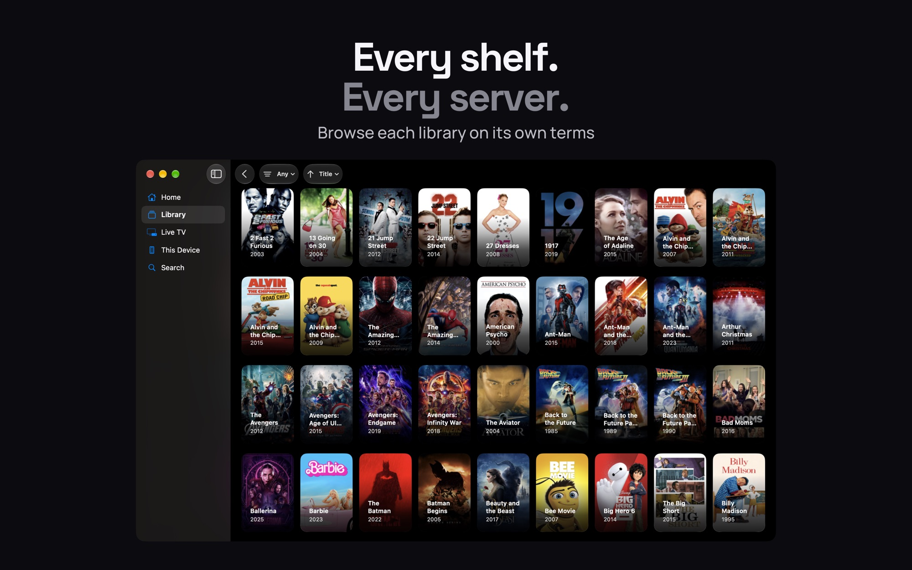
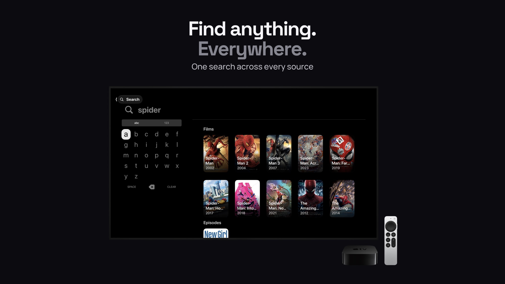
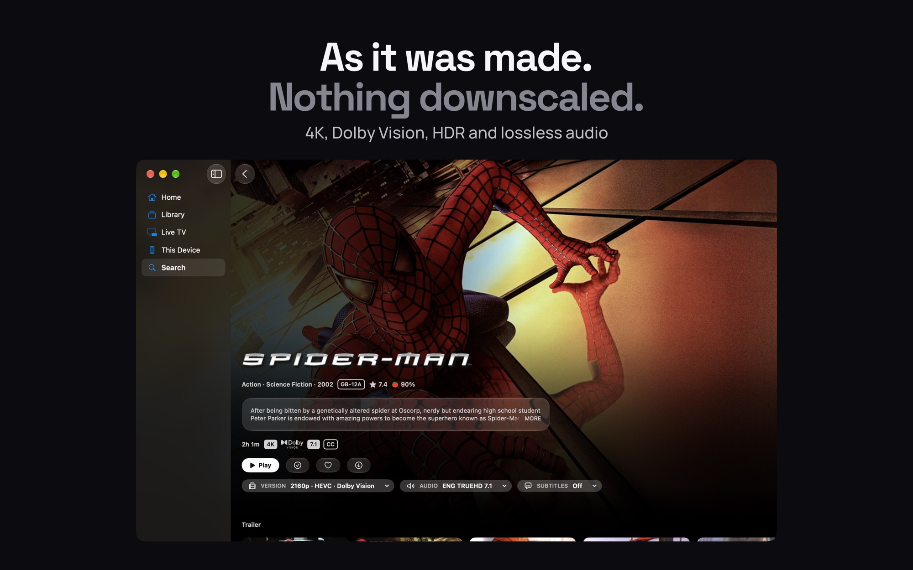
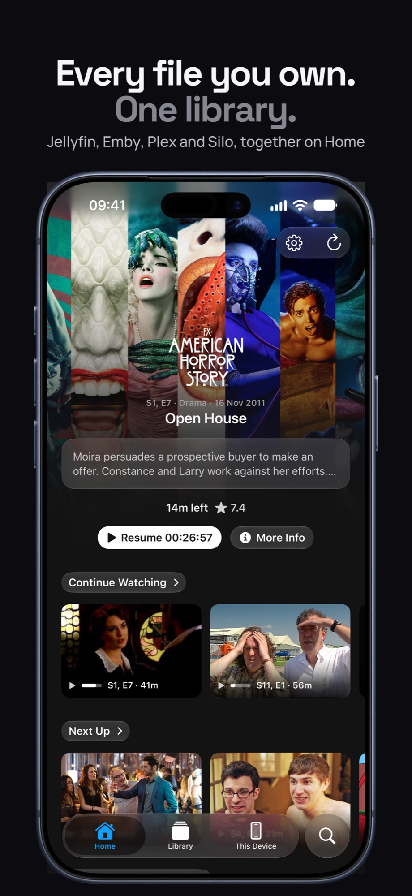
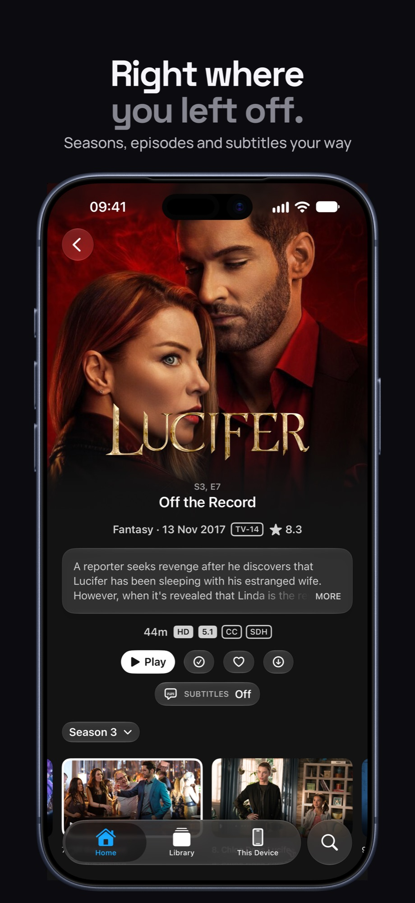
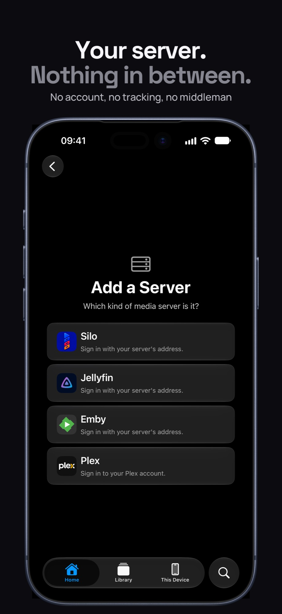

## Introduction

[**Photon**](https://photon.oliverwalton.uk) is a video player for iPhone, iPad, Apple TV and Mac, built around one idea: *every file you own, one library*.

If you keep your own film and TV collection, you probably use two or three different apps to watch it: one for each media server, another for files on your computer, and maybe another for Live TV. Photon puts all of it in one place. It connects to [**Jellyfin**](https://jellyfin.org/), [**Plex**](https://www.plex.tv/), [**Emby**](https://emby.media/) and **Silo** servers, plus cloud drives, network shares and IPTV, and shows everything on one home screen with one search and one continue-watching row. It's [**on the App Store**](https://apps.apple.com/us/app/photon-player/id6804291311?mt=12) now.

To be clear about what it isn't: Photon doesn't host anything and doesn't find content for you. It only plays files that you already have, from your own server or device.

## One Library, However Many Servers

Photon asks every connected source the same question at once. For example, the home screen asks "what's new?" and search asks "what matches *spider*?". It then merges the answers into one list. If a server is offline or slow, its results are left out and everything else still loads. One server being down shouldn't break the rest of the app.

Each server is still browsable separately, with its own libraries, so merging everything together doesn't take away the structure you've already set up.

It isn't only for servers, either. On the Mac, Photon can open any video straight from Finder, and you can set it as your default video player. It handles the files QuickTime won't open.

## Played As It Was Made

A lot of the work in Photon went into playing files exactly as they are. There's no quality loss and no quietly converting a file into something easier to play.

Most third-party players on Apple devices bundle their own video engine. Photon uses Apple's built-in playback instead, for a few reasons. It's what the hardware is designed for, it's the most efficient on battery, and it's the only way to get proper Dolby Vision on Apple devices. The problem is that Apple's player is fussy about what it accepts. It won't open any MKV files, and it can't play some of the lossless audio formats found in Blu-ray rips.

So instead of replacing Apple's player, Photon remuxes files into a form the player will accept, while the file is playing:

- **MKV files** are remuxed on the device and handed to Apple's player in a format it understands. The video itself is never re-encoded.
- **Lossless audio** like Dolby TrueHD and DTS-HD is converted to another lossless format Apple devices support, so the sound is identical to the original.
- **Dolby Vision** is handled for every profile Apple supports. One common Blu-ray variant that Apple devices can't play at all gets converted to a compatible one, so you still get Dolby Vision instead of losing it. When conversion isn't possible, Photon falls back to plain HDR10 and says so on screen rather than claiming Dolby Vision it can't deliver.

For the few formats no Apple device can play at all, Photon asks the server to convert the file as a last resort.

## Drives, Shares and Live TV

Not everyone runs a media server, so Photon also connects directly to **Dropbox**, **Google Drive**, **OneDrive** and **WebDAV** network shares. You sign in through the normal system login screen, and your files show up alongside everything else.

**Live TV** works with IPTV providers and includes a full programme guide. On Apple TV and Mac the guide is laid out as a grid, and on iPhone it's a simpler channel list.

## Built For Every Screen

Photon is one app across four platforms, but each one is designed for how that device is actually used. Apple TV is navigated with a remote from the sofa. Mac has a sidebar, keyboard shortcuts and Finder integration. iPhone is built for one hand. Downloads let you watch offline. Handoff lets you start something on one device and carry on watching on another. Top Shelf and Spotlight put your library into the system itself.

## Private by Default

There's no Photon account to create, no analytics and no tracking. Nothing of mine sits between you and your server. Passwords are stored in the system keychain. Your list of servers syncs between your devices through your own iCloud, with the addresses encrypted.

## Where It's At

Photon is live on the App Store for iPhone, iPad, Apple TV and Mac. It is early days so there will be bugs and a couple oversights that have been missed over the past few months of development, but Photon strives to be as stable and performant as possible so any feedback is greatly appreciated!
