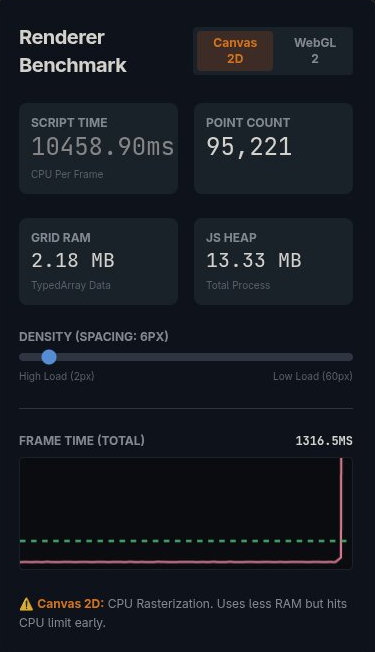
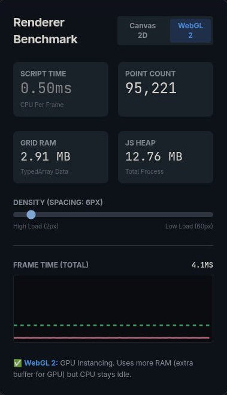
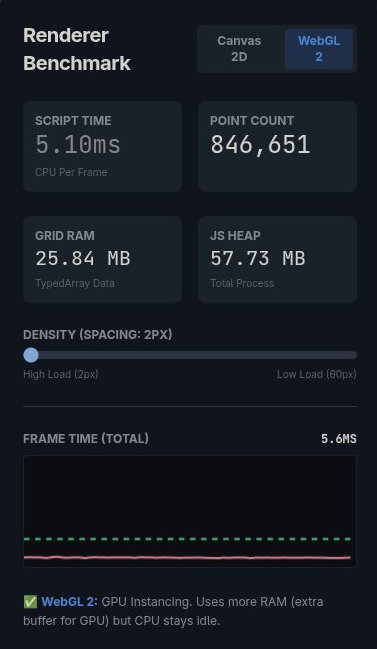
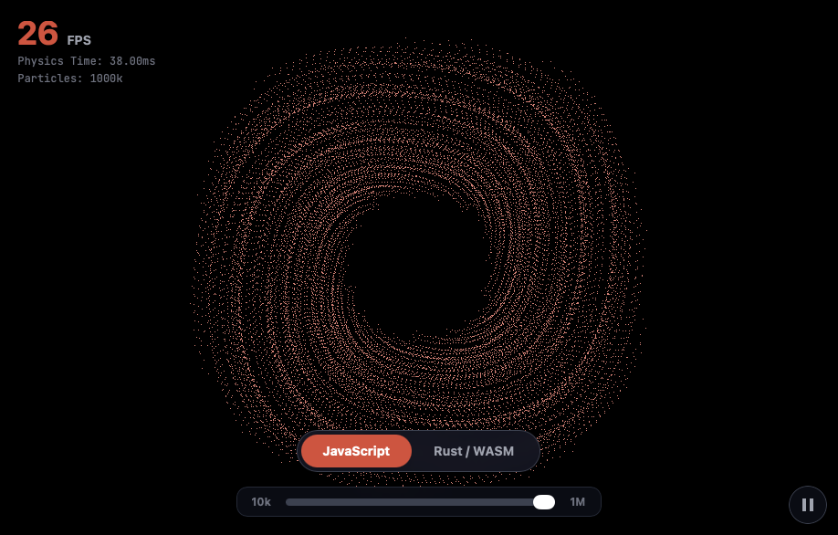
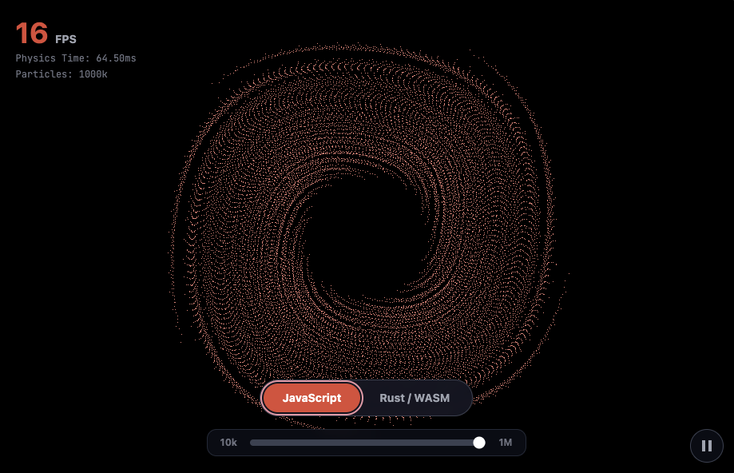
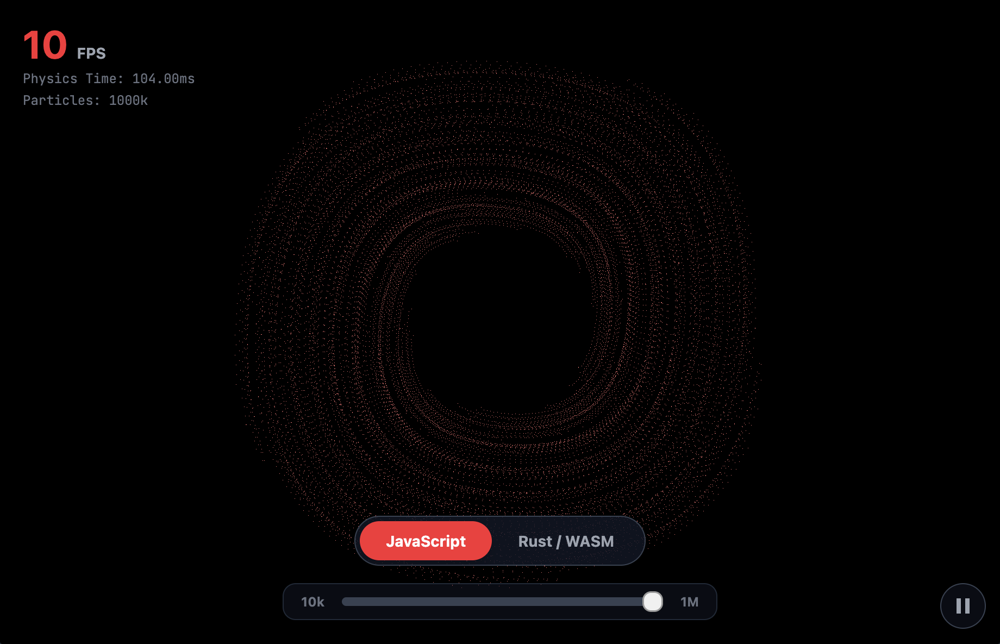

<script>
	import BenchmarkVisual from '$lib/components/visuals/BenchmarkVisual.svelte';
</script>

## Introduction

I first built my [**original**](https://github.com/olivertgwalton/portfolio) portfolio website back when I was 16, a whole six years ago, so it felt right taking the knowledge I've gained in that time to make this new one! It was a simple HTML/CSS/JS website, aiming for minimalism and maximum performance (while remaining modern designed) - I'd like to continue that idea with 2026 ideas. Which leaves me with _plenty_ to talk about.

## Bun

Every decision I make in software is intended with performance being considered, so adopting [Bun](https://bun.com/) made perfect sense. Bun is an alternative JavaScript runtime, slowly replacing [Node.JS](https://nodejs.org/en) as the go-to for new projects. It is faster from cold start to I/O throughput. So why is that?

### JavaScriptCore

Most runtimes, including the likes of Node and Deno, use Google's V8 engine. Bun instead opts for Apple's [**JavaScriptCore**](https://developer.apple.com/documentation/javascriptcore) (JSC). They both have their advantages; while V8 is optimised for raw throughput, JSC is optimised for faster startup times and lower memory usage - crucial for CLI tools and serverless environments. This makes it ideal for the majority of web environments.

### Zig

Underpinning all of this is [**Zig**](https://ziglang.org/). While other "performant" runtimes might reach for C++ or Rust, Bun is written almost entirely in Zig - a systems programming language. Other performance-oriented applications i.e [**Ghostty**](https://github.com/ghostty-org/ghostty) also utilise Zig. This allows for:

- **Manual Memory Management**: Unlike Go or Java, Zig gives the developer total control over memory allocation, making use of pointers. There is no hidden Garbage Collector (GC) introducing unpredictable "stop-the-world" pauses. This sounds great until you spend three hours debugging a segfault because you tried to access a pointer you freed two function calls ago. It forces you to think about the lifecycle of every single byte.
- **Data-Oriented Design**: Zig encourages cache-friendly data structures. While most modern development makes use of OOP, creating **Array of Objects**, Zig encourages **Structure of Arrays** - something I utilise further on.
- **SIMD**: Zig makes it trivial to leverage **SIMD** (Single Instruction, Multiple Data) instructions; **AVX, SSE, NEON** - allowing Bun to process multiple pieces of data in parallel on the CPU - essential for tasks like parsing JSON or UTF-8; a common bottleneck in web development.

### OS Primitives

Node.js relies on [`libuv`](https://libuv.org/), a cross-platform library that handles asynchronous I/O. It is robust, however, it acts as a "middle-man," abstracting the lower-level OS primitives by introducing overhead through a layer of user-space. When you read a file or open a socket in Node, your request travels through several layers before reaching the kernel.

**Bun**, in contrast, is designed to be far more hardware-friendly - taking advantage of kernel-space interfaces. On Linux, it leverages [`io_uring`](https://man7.org/linux/man-pages/man7/io_uring.7.html), a modern API introduced in Linux 5.1, it is an asynchronous I/O interface that allows the application to submit I/O requests directly to the kernel via a shared memory buffer. This interface enables:

- **Zero-Copy**: Standard I/O operations involve copying memory between user space (where your application lives) and kernel space (where the OS lives) for every read or write. This consumes significant CPU cycles. `io_uring` allows applications to **register buffers** with the kernel, creating a shared memory region. The kernel can then read from or write directly to these pre-registered buffers, bypassing the intermediate copy entirely.
- **Batching**: Instead of sending requests one-at-a-time, multiple I/O operations can be submitted and completed in a single system call, drastically reducing the CPU cost of context switching, increasing throughput drastically.

This architectural difference is like upgrading from a waiter who runs to the kitchen for every single order (Node/libuv) to a digital ordering system that streams requests instantly and in batches (Bun/io_uring). The result is significantly higher throughput and lower latency for file system and network operations - effectively all that web development relies on.

## InteractiveGrid

The hero section contains an interactive particle grid which responds to mouse movements; running a calculation to mimic physics of pushing away from the cursor. This caused quite a paradox between the performance-oriented development, and having a constantly updating script on every 16ms frame "budget". This led me to see how far I could optimise the standard Canvas 2D API, but if I fall into the trap of WebAssembly using **cough** rust **cough**, that wouldn't be the end of the world. I won't even begin to mention [**WebGL**](https://wikis.khronos.org/webgl/Main_Page), or worse, [**WebGPU**](https://www.w3.org/TR/webgpu/). Though if you are interested here is an AI-made attempt at WebGL:


### Layout Thrashing

In my first attempt I had overlooked the calculation of mouse position being relative to the canvas requiring calling `getBoundingClientRect()` on every `mousemove` event. This is an expensive operation because it forces the browser to recalculate the page layout; effectively worse than standard React virtualDOM. I optimised this by **caching the canvas boundaries** and only updating them when the user scrolls or resizes the window, ensuring the animation loop remains lean and focused strictly on the physics maths.

```typescript title="InteractiveGrid.svelte"
function handleMouseMove(e: MouseEvent) {
  const rect = canvas?.getBoundingClientRect();
  if (!rect) return;
  mouseX = (e.clientX - rect.left) * dpr;
  mouseY = (e.clientY - rect.top) * dpr;
}
```

- **Scripting Overhead:** Removing `getBoundingClientRect` from the `mousemove` handler reduced the "Scripting" time in the browser's performance profiler by over **90%** during interaction. I eliminated the forced reflows (layout calculations) that were previously firing on every mouse event, ensuring the main thread is free to drive the animation at a rock-solid 240 FPS (I'm limited by my monitor's refresh rate).

### Performance Impact

An initial optimisation was to use **Structure of Arrays (SoA)** - a low-level performance optimisation that factors in how the underlying CPU architecture is designed. This approach allows for **Single Instruction, Multiple Data (SIMD)** operations, which can significantly improve performance by executing multiple operations in parallel - the same approach made by Zig, mentioned earlier.

- **Time Complexity:** While both **Array of Objects (AoO)** and **Structure of Arrays (SoA)** approaches are technically $O(n)$, the SoA approach significantly reduces the constant factor by improving cache locality.
- **Memory Footprint:** Switching to TypedArrays reduced the memory usage for the grid data by approximately **60%**. I no longer store object headers, pointers, and property keys for 2,000+ points - just raw, contiguous binary data. The Rust engine takes this further with a pure SoA layout, each field is a contiguous `Vec<f32>`:

```rust title="rust-grid/src/lib.rs"
#[wasm_bindgen]
pub struct GridEngine {
    pos_x: Vec<f32>,      // All X positions, contiguous
    pos_y: Vec<f32>,      // All Y positions, contiguous
    origin_x: Vec<f32>,   // All origin X, contiguous
    origin_y: Vec<f32>,   // All origin Y, contiguous
    vel_x: Vec<f32>,      // All velocity X, contiguous
    vel_y: Vec<f32>,      // All velocity Y, contiguous
    count: usize,
    radius_sq: f32,
    last_dpr: f32,
}
```

Below is the processing time for **20000** points:

```text
Array of Objects (AoO): 20ms - timer ended
TypedArray (SoA): 10ms - timer ended
```

An initial thought might be that it is only a 10ms saving in processing time, and that isn't even the realistic element count; that is only the beginning of the performance gains.

### The WebAssembly Saviour

While the **Structure of Arrays (SoA)** approach with `Float32Array` was a massive improvement over standard objects, I wanted to see if I could push the performance envelope even further. This led me to integrate **Rust** via **WebAssembly (WASM)**.

<BenchmarkVisual />

However, integrating Rust into a modern Vite pipeline felt like fighting two different build systems simultaneously. `wasm-pack` generates a mountain of glue code that TypeScript absolutely hated; implicit `any` types everywhere. I spent a solid evening just fighting my own linter, eventually having to disable the directories entirely and rigidly structure my directories just to get the CI to pass.

By offloading the physics calculations to Rust, I achieve several critical wins:

1.  **Instruction Density**: Rust compiles to highly optimised WASM bytecode. Unlike JavaScript, there is no JIT compilation "warm-up" or unpredictable optimisations.
2.  **Zero-Copy Memory**: I created a `Float32Array` view directly on the **shared WASM memory buffer**. This allows the browser to render the coordinates directly from Rust's memory space without any expensive copying or serialisation.
3.  **Predictable Latency**: By using a systems language with manual memory management (no Garbage Collector), I eliminate the tiny "micro-stutters" that occur when JS cleans up temporary objects.

The zero-copy bridge between Rust and JavaScript looks like this:

```typescript title="InteractiveGrid.svelte"
// JS creates typed array views directly on WASM memory — no copying
posX = new Float32Array(wasmMemory.buffer, engine.pos_x_ptr(), numPoints);
posY = new Float32Array(wasmMemory.buffer, engine.pos_y_ptr(), numPoints);
```

```rust title="rust-grid/src/lib.rs"
// Expose raw pointers to its contiguous Vec memory
pub fn pos_x_ptr(&self) -> *const f32 { self.pos_x.as_ptr() }
pub fn pos_y_ptr(&self) -> *const f32 { self.pos_y.as_ptr() }
```

### Benchmark Results: JS vs. Rust/WASM

In the visual above, I have compared **JavaScript (Array of Objects)** against **Rust (Structure of Arrays)**. At a scale of up to **1 million particles**, and the results speak for themselves:

- **JavaScript (AoO)**: The CPU spends significant time jumping around the memory heap to find object properties, leading to frequent L2/L3 cache misses.
- **Rust / WASM (SoA)**: The linear memory layout allows the CPU's pre-fetcher to load data with near 100% efficiency.

You might notice that on smaller scales, the difference is negligible. This is a testament to the optimisation engineering in engines like V8 and JSC. However, once the dataset exceeds the **CPU Cache**, the architectural decisions of Rust's memory model become the deciding factor.

Another consideration that is eliminated with the move to **Rust**, is the discrepancies in performance between the JS engines. I was surprised to see the 150% performance gap between Firefox and Safari. Rust at 110fps, with Firefox's SpiderMonkey JavaScript engine at 10fps, there is an **11x** uplift in performance - following [Moore's Law](https://en.wikipedia.org/wiki/Moore%27s_law), this would be equivalent to 7 years of performance gains.



## Svelte 5

Modern web frameworks often feel like they're competing on features, but Svelte 5 is competing on architecture. While React and its descendants rely on the [**Virtual DOM**](https://react.dev/learn/preserving-and-resetting-state#the-ui-tree) for reconciliation, Svelte 5 doubles down on being a compiler, introducing a paradigm shift with **Runes**.

### Re-rendering vs. Reactivity

In **React**, when state changes, the entire component (and potentially its children) re-renders. React then creates a new Virtual DOM tree, compares it with the previous one (diffing), and calculates the minimum set of changes to apply to the real DOM. This process is effectively $O(n^3)$ relative to the size of the component tree - work that has to happen in the user's browser every single time. In React's defense it uses a heuristic algorithm, which allows for a far more acceptable $O(n)$. However, this still includes the memory overhead and the **committing** to the real DOM.

**Svelte 5** takes a different path. It doesn't have a Virtual DOM. Instead, it uses **Runes** (`$state`, `$derived`, `$effect`) to create fine-grained, signals-based reactivity at compile-time.

- **`$state`**: Declares reactive state.
- **`$derived`**: Handled logic that depends on state, automatically updating only when needed.
- **`$effect`**: Side effects that run when dependencies change.

Here's how they work together in the theme switcher:

```svelte title="ThemeSwitcher.svelte"
<script lang="ts">
  let currentTheme = $state('modern');
  let currentMode = $state('system');
  let systemDark = $state(false);

  // $effect: Re-runs automatically when currentMode, currentTheme,
  // or systemDark changes — no dependency arrays needed
  $effect(() => {
    const media = window.matchMedia('(prefers-color-scheme: dark)');
    systemDark = media.matches;

    const isDark = currentMode === 'dark'
      || (currentMode === 'system' && systemDark);

    document.documentElement.classList.toggle('dark', isDark);
    document.documentElement.setAttribute('data-theme', currentTheme);
  });
</script>
```

And `$derived` in the benchmark, where FPS is automatically computed from the measured frame time:

```typescript title="BenchmarkVisual.svelte"
let frameTime = $state(0);
let fps = $derived(frameTime > 0 ? 1000 / frameTime : 0);
```

### Zero-Overhead

Because Svelte 5 knows exactly which part of the DOM depends on which piece of state, it can generate optimised JavaScript that updates the DOM directly. This reduces the complexity of updates to $O(1)$; precise changes without traversing a tree (and not at runtime). Compiling at build time turns the components directly into JavaScript and DOM instructions.

This means that as your application grows, you don't pay a "framework tax" on every interaction. The performance remains predictable because the work is done during your build step, not on your user's device. For a portfolio built on the principle of maximum performance, this was a strong consideration that was factored in.

## Markdown

If you have ever read a README, you are reading a markdown file. Just to clarify, you are actually reading a processed markdown, otherwise it is just a wall of text in your favourite text editor. So why not do the same for these posts?

### MDsveX

If Svelte and Markdown had a baby, it would be [**MDsveX**](https://mdsvex.com/). A preprocessor that lets you import Svelte components _directly_ into your markdown files.

### Prism vs Shiki

When you see code blocks on a blog, they're usually colored to make them readable. The old-school way to do this was **PrismJS**. It's great, but it runs in the browser. It has to download a script, parse your code on the client side, and then inject a bunch of span tags to colourise it. It works, but it causes layout shifts and eats up main-thread resources.

Enter [**Shiki**](https://shiki.style/). Shiki uses the same syntax highlighter as VS Code (TextMate grammars), meaning your code blocks look _exactly_ like they do in your editor. It's pixel-perfect. But the real killer feature?

### Runtime vs Build Time

Shiki runs at **build time**. When I deploy this site, Shiki runs on the server, figures out all the colours and tokens, and bakes them into the final HTML as static CSS classes. By the time this page reaches your phone or laptop, there is **zero** JavaScript running to highlight code. No layout shift. No "flash of unstyled content". Just raw, accessible HTML that looks native to the website instantly.

```javascript title="svelte.config.js"
const highlighter = await createHighlighter({
  themes: ['github-light', 'github-dark'],
  langs: ['typescript', 'javascript', 'svelte', 'bash', 'css', 'html', 'json', 'markdown', 'python']
});

// mdsvex highlight option — runs once at build time
highlight: {
  highlighter: async (code, lang = 'text') => {
    const html = highlighter.codeToHtml(code, {
      lang,
      themes: { light: 'github-light', dark: 'github-dark' },
      defaultColor: false
    });
    return `{@html \`${escapeSvelte(html)}\`}`;
  }
}
```

## The Little Things

It's often the small details that make a project feel polished. While the headline features are Bun, Rust and Svelte, I've spent just as much time refining the user experience.

### Skeleton & Theming

For the UI, I am making use of [**Skeleton**](https://www.skeleton.dev/). It's a UI toolkit for Svelte that integrates seamlessly with Tailwind V4 CSS. Instead of fighting against a component library's styles, I can create native Svelte 5 components from scratch.

I've implemented a theming engine that respects your system preference by default but allows for manual toggling, it also has complete support for light/dark mode in every theme. This isn't just swapping a few CSS variables; it triggers a complete state update across the application, ensuring that even the canvas-based particle simulations react instantly to the new colour palette. The theme state is persisted in cookies, so your choice is remembered the next time you visit. All made easier using Skeleton and tailwind, I just set `--var-name(200-800)` and the colour for light and dark theme will be selected automatically.

The theme toggle uses the **View Transitions API** to create a circular reveal animation from the click point:

```typescript title="ThemeSwitcher.svelte"
async function performTransition(action: () => void, event?: MouseEvent) {
  if (!document.startViewTransition || !event) { action(); return; }

  const x = event.clientX;
  const y = event.clientY;
  const endRadius = Math.hypot(
    Math.max(x, innerWidth - x),
    Math.max(y, innerHeight - y)
  );

  const transition = document.startViewTransition(async () => {
    action();
    await tick();
  });

  await transition.ready;

  document.documentElement.animate(
    { clipPath: [
      `circle(0px at ${x}px ${y}px)`,
      `circle(${endRadius}px at ${x}px ${y}px)`
    ]},
    { duration: 500, easing: 'ease-in-out',
      pseudoElement: '::view-transition-new(root)' }
  );
}
```

### Automatic Read Time

You might have noticed the "X min read" at the top of posts. That isn't being written manually; during the build process, I use a `remark` plugin to parse the markdown content, estimate the reading time based on word count, images and any other relevant elements, and inject it into the post's metadata. It's a small convenience that respects the reader's time.

```javascript title="svelte.config.js"
function remarkReadTime() {
  return function (tree, file) {
    const text = toString(tree);
    const readingTime = getReadingTime(text);
    file.data.fm = {
      ...file.data.fm,
      readTime: Math.ceil(readingTime.minutes) + ' min read'
    };
  };
}
```

### Accessibility (A11y)

I have made sure that all interactive elements are capable of being navigated via keyboard, and have appropriate ARIA labels for full screenreader support. The benchmark visualisation for example, includes controls that are usable by screen readers and keyboard navigation, despite being a heavy graphical simulation.

### Dynamic OG Images

Every page generates its own Open Graph image on the fly using [**Takumi**](https://github.com/kane50613/takumi), a Rust-based image rendering engine. Unlike the traditional Satori → Resvg pipeline which generates an intermediate SVG before rasterising, Takumi renders directly to PNG, with built-in Tailwind CSS support. So when you share the link on social media, you get a branded, page-specific preview card without me maintaining a single static image.

### Convenience Features

I have also included a few other quality-of-life features throughout the website:
- **Copy Buttons**: Every code block has a one-click copy button.
- **Table of Contents**: Generated automatically from the markdown headers, allowing you to jump straight to the sections that interest you.
- **Scroll Progress**: An indicator at the top of the page showing how far you've read.
- **Back to Top Button**: A convenient button taking you to the top of the page.


## Conclusion

Building this new portfolio has been an exercise in questioning defaults.

By choosing **Bun**, **Svelte 5**, **Shiki** and **Rust**, I’ve built a site that is fully functional but significantly faster than it otherwise could have been. It’s not just about Lighthouse scores (though 100s across the board is nice); it’s about the **feeling** of the site. It’s snappy, responsive, and respectful of your battery life.

More importantly, the barrier to writing is now zero. I can open a markdown file, drop in a component, write some maths, and push. No CMS to manage, no database to maintain. Just text and code.

I hope you found this interesting. If you spot any bugs (or typos), you know where to find the repo. Thanks for reading!
